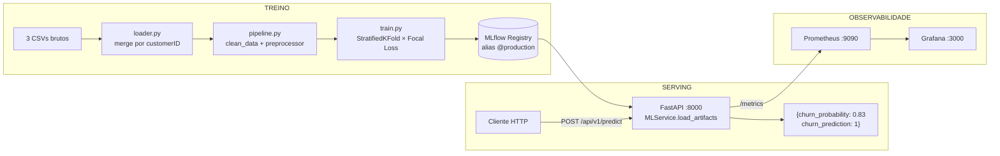

# ML Telco Churn — Previsão de Cancelamento de Clientes via MLP PyTorch


Pipeline completo de ML end-to-end: do EDA ao serving em produção com FastAPI + MLflow, aplicado ao problema de churn em telecomunicações.

---

## Visão Geral

**Problema:** Empresas de telecom perdem clientes sem identificá-los a tempo. Reter um cliente custa ~10× menos que adquirir um novo.

**Solução:** Classificador binário que prevê a probabilidade de churn de cada cliente, permitindo campanhas de retenção proativas.

| Campo | Valor |
|---|---|
| Dataset | [IBM Telco Customer Churn](https://www.kaggle.com/datasets/blastchar/telco-customer-churn) (~7 043 clientes, 3 CSVs) |
| Modelo | `MLP_Focal_KFold_Script` — MLP PyTorch com Focal Loss + StratifiedKFold(3) |
| Métrica primária | PR-AUC = **0.6539** (holdout de 20%) |
| Serving | FastAPI + MLflow Model Registry — alias `@production` |

---

## Arquitetura



---

## Stack Tecnológica

| Camada | Tecnologia | Versão mínima |
|---|---|---|
| Linguagem | Python | ≥ 3.13 |
| Deep Learning | PyTorch | ≥ 2.11.0 |
| Preprocessamento | Scikit-Learn | ≥ 1.8.0 |
| Hyperparameter Tuning | Optuna | ≥ 4.8.0 |
| MLOps / Registry | MLflow | 3.11.1 |
| API Framework | FastAPI | ≥ 0.135.2 |
| ASGI Server | Uvicorn | ≥ 0.42.0 |
| Gerenciamento de deps | uv | qualquer |
| Containerização | Docker + Compose | — |
| Lint / Format | Ruff | ≥ 0.15.7 |
| Testes | Pytest + Pandera | ≥ 9.0.2 |

---

## Estrutura do Repositório

```
ML_TELCO_CHURN/
│
├── src/                          # Código de produção
│   ├── main.py                   # Entrypoint FastAPI (lifespan, CORS, middlewares)
│   ├── api/
│   │   └── v1/api.py             # Router: POST /api/v1/predict
│   ├── core/
│   │   ├── config.py             # ProjectConfig — hiperparâmetros, seeds, feature lists
│   │   ├── schemas.py            # Contratos Pydantic (ChurnPredictionRequest/Response)
│   │   ├── ml_service.py         # Singleton MLService — carrega artefatos MLflow
│   │   ├── middlewares.py        # LoggingMiddleware (method/path/status/latency)
│   │   ├── database.py           # Engine AsyncSQLAlchemy (aiosqlite)
│   │   └── deps.py               # Injeção de dependências (get_db)
│   ├── data/
│   │   └── loader.py             # load_and_merge_data() — merge dos 3 CSVs
│   ├── features/
│   │   ├── pipeline.py           # clean_data(), get_preprocessor(), prepare_target()
│   │   └── build_features.py     # Utilitários de features derivadas
│   └── models/
│       ├── architectures.py      # ChurnMLP (nn.Module) + FocalLoss
│       ├── train.py              # Script de treino end-to-end (CLI via argparse)
│       └── trainer.py            # train_focal_model() — AdamW + OneCycleLR + EarlyStopping
│
├── notebooks/                    # Exploração e desenvolvimento iterativo
│   ├── 01_eda_feature_engineering.ipynb
│   ├── 02_baselines.ipynb        # Regressão Logística, GBM, baselines sklearn
│   ├── 03_mlp_pytorch.ipynb      # MLP vanilla + Optuna
│   ├── 04_advanced_feature_engineering.ipynb
│   ├── 05_mlp_pytorch_advanced_features.ipynb
│   ├── 06_mlp_advanced_loss.ipynb  # Focal Loss — modelo campeão
│   ├── 07_mlp_resnet_embeddings.ipynb
│   └── data/
│       ├── raw/                  # CSVs originais (não commitar dados sensíveis)
│       └── processed/            # Artefatos intermediários
│
├── tests/                        # Suíte Pytest
│   ├── test_config.py
│   ├── api/
│   │   ├── test_main.py
│   │   ├── test_middlewares.py
│   │   ├── test_ml_service.py
│   │   ├── test_schemas.py
│   │   └── test_schema_pandera.py
│   └── features/
│       └── test_pipeline.py
│
├── docs/                         # Documentação técnica
│   ├── MODEL_CARD.md             # Model Card completo (performance, limitações, uso)
│   ├── DEPLOYMENT_ARCHITECTURE.md  # Arquitetura de deploy + diagramas Mermaid
│   ├── MONITORING_PLAN.md        # Plano de monitoramento e detecção de drift
│   ├── tech_challenge_decisions.md # Narrativa histórica de decisões do projeto
│   ├── plans/                    # Planos de iteração (por data)
│   ├── reports/                  # Relatórios de experimentos e comparações
│   └── specs/
│       ├── adrs/                 # Architecture Decision Records (ADR-001 a ADR-009)
│       └── *.md                  # Design specs por fase
│
├── mock_request.json             # Payload exemplo — cliente de alto risco (tenure=2)
├── mock_request_loyal.json       # Payload exemplo — cliente fiel (tenure=72)
├── Dockerfile                    # Build multi-stage (builder uv → runtime python:3.13-slim)
├── docker-compose.yml            # Orquestração: serviços `mlflow` (5000) + `api` (8000)
├── Makefile                      # Comandos de dev: test, train, run, mlflowui, db-upgrade
├── pyproject.toml                # Dependências + configuração Ruff + Hatch
└── README.md
```

> **Notebooks vs. Scripts:** Use os notebooks para exploração, EDA e prototipagem. Para treinar o modelo oficial e registrá-lo no MLflow (reproduzível), use sempre `src/models/train.py` via `make train`.

---

## Pré-requisitos

| Ferramenta       | Versão   | Instalação                                                                                              |
| ---------------- | -------- | -------------------------------------------------------------------------------------------------------- |
| Python           | ≥ 3.13  | [python.org](https://www.python.org/)                                                                    |
| uv               | qualquer | Linux/macOS: `curl -LsSf https://astral.sh/uv/install.sh \| sh` · Windows: veja abaixo               |
| Docker + Compose | qualquer | [docker.com](https://www.docker.com/) (opcional, para deploy containerizado)                             |
| Make             | qualquer | Pré-instalado em Linux/macOS; Windows: [GnuWin32](http://gnuwin32.sourceforge.net/packages/make.htm), [Git Bash](https://git-scm.com/download/win) ou WSL2 |

**Instalando o `uv` no Windows (PowerShell):**

```powershell
# PowerShell — requer execução como usuário normal (sem elevação necessária)
powershell -ExecutionPolicy ByPass -c "irm https://astral.sh/uv/install.ps1 | iex"
```

> **Nota Windows:** Os targets `make train` e `make run` usam sintaxe de variáveis de ambiente inline do shell Unix (`VAR=value command`). No Windows **sem Git Bash ou WSL2**, o `make` do GnuWin32 não processa essa sintaxe. Use os [comandos equivalentes sem `make`](#comandos-equivalentes-sem-make-windows) documentados abaixo, ou rode via **Git Bash** / **WSL2**.

**Dados:** Os CSVs de dados brutos devem ser colocados em `notebooks/data/raw/`. Veja a [seção Dados](#dados).

---

## Instalação

### Ambiente Local (recomendado para desenvolvimento)

```bash
# 1. Clonar o repositório
git clone <url-do-repositorio>
cd ML_TELCO_CHURN

# 2. Instalar todas as dependências (incluindo dev e eda)
uv sync

# 3. Inicializar o banco de dados do MLflow
make db-upgrade
```

**Sem `make` (Windows PowerShell ou qualquer OS):**

```powershell
# Equivalente ao make db-upgrade
uv run mlflow db upgrade sqlite:///mlflow.db
```

### Dependências Principais (gerenciadas pelo uv)

| Grupo                       | Conteúdo                                                            |
| --------------------------- | -------------------------------------------------------------------- |
| `[project.dependencies]`  | Produção: FastAPI, MLflow, PyTorch, Optuna, Scikit-Learn, Pydantic |
| `[dependency-groups.dev]` | Testes e qualidade: pytest, httpx, pandera, ruff                     |
| `[dependency-groups.eda]` | Notebooks: jupyterlab, matplotlib, seaborn, scipy, imbalanced-learn  |

Para instalar apenas produção (sem dev/eda), use: `uv sync --no-dev --no-group eda`

### Via Docker (recomendado para deploy)

```bash
# Build e start dos serviços mlflow + api
docker compose up --build

# Health check
curl http://localhost:8000/health
```

---

## Quickstart

> Execução end-to-end em 5 comandos. **Pré-requisito:** dados em `notebooks/data/raw/` e `uv` instalado.

### bash (Linux/macOS) ou Git Bash (Windows)

```bash
# 1. Instalar dependências
uv sync

# 2. Treinar e registrar o modelo no MLflow
make train ARGS="--epochs 150"

# 3. Subir a API (em outro terminal)
make run

# 4. Smoke test de saúde
curl http://localhost:8000/health

# 5. Inferência com o cliente de alto risco de exemplo
curl -X POST http://localhost:8000/api/v1/predict \
  -H "Content-Type: application/json" \
  -d @mock_request.json
```

### PowerShell (Windows — sem `make`)

```powershell
# 1. Instalar dependências
uv sync

# 2. Treinar e registrar o modelo no MLflow
$env:MLFLOW_TRACKING_URI="sqlite:///mlflow.db"; $env:PYTHONPATH="."; uv run python src/models/train.py --epochs 150

# 3. Inicializar banco MLflow e subir a API (em outro terminal PowerShell)
uv run mlflow db upgrade sqlite:///mlflow.db
$env:PYTHONPATH="."; uv run uvicorn src.main:app --host 0.0.0.0 --port 8000 --reload

# 4. Smoke test de saúde
Invoke-RestMethod -Uri "http://localhost:8000/health"

# 5. Inferência com o cliente de alto risco de exemplo
Invoke-RestMethod -Uri "http://localhost:8000/api/v1/predict" `
  -Method POST `
  -ContentType "application/json" `
  -Body (Get-Content mock_request.json -Raw)
```

---

## Como Usar

### Treinamento

O script de treino é `src/models/train.py`, executado via `Makefile`:

```bash
# Treino padrão (5 épocas — rápido para validar o pipeline)
make train

# Treino completo para produção (150 épocas)
make train ARGS="--epochs 150"

# Com caminhos personalizados para os CSVs
make train ARGS="--epochs 150 \
  --customers notebooks/data/raw/churn_customers.csv \
  --services  notebooks/data/raw/churn_services.csv \
  --contracts notebooks/data/raw/churn_contracts.csv"
```

#### Comandos equivalentes sem `make` (Windows PowerShell) {#comandos-equivalentes-sem-make-windows}

```powershell
# Inicializar banco MLflow (uma vez)
uv run mlflow db upgrade sqlite:///mlflow.db

# Treino padrão (5 épocas)
$env:MLFLOW_TRACKING_URI="sqlite:///mlflow.db"; $env:PYTHONPATH="."; uv run python src/models/train.py --epochs 5

# Treino completo para produção (150 épocas)
$env:MLFLOW_TRACKING_URI="sqlite:///mlflow.db"; $env:PYTHONPATH="."; uv run python src/models/train.py --epochs 150
```

**Argumentos CLI disponíveis (`src/models/train.py`):**

| Argumento       | Padrão                                    | Descrição                                          |
| --------------- | ------------------------------------------ | ---------------------------------------------------- |
| `--customers` | `notebooks/data/raw/churn_customers.csv` | CSV de dados demográficos                           |
| `--services`  | `notebooks/data/raw/churn_services.csv`  | CSV de serviços contratados                         |
| `--contracts` | `notebooks/data/raw/churn_contracts.csv` | CSV de contratos e target                            |
| `--epochs`    | `5`                                      | Número máximo de épocas (use 150 para produção) |

**O que o treino faz:**

1. Carrega e faz merge dos 3 CSVs (`customerID` como chave)
2. Aplica `clean_data()` — limpeza + 6 features derivadas
3. Split estratificado 80/20 (`random_state=42`)
4. Fit do `ColumnTransformer` (StandardScaler + OHE) exclusivamente no X_train
5. `StratifiedKFold(n_splits=3)` com `train_focal_model()` em cada fold
6. Retreino do modelo final + avaliação no holdout X_test
7. Log no MLflow: parâmetros, métricas, preprocessor (sklearn) e modelo PyTorch
8. Registro no MLflow Model Registry como `MLP_Focal_KFold_Script`

> Após o treino, **atribua o alias `@production`** à nova versão para que a API possa carregá-la:
>
> **Opção A — CLI MLflow (Linux/macOS/Windows):**
> ```bash
> uv run mlflow models set-alias --name MLP_Focal_KFold_Script --alias production --model-version <N>
> ```
>
> **Opção B — Python SDK (recomendado, funciona em qualquer OS):**
> ```python
> # Execute com: uv run python -c "..."  ou em um shell Python
> import mlflow
> mlflow.set_tracking_uri("sqlite:///mlflow.db")
> client = mlflow.tracking.MlflowClient()
> versions = client.get_latest_versions("MLP_Focal_KFold_Script")
> latest = versions[0].version
> client.set_registered_model_alias("MLP_Focal_KFold_Script", "production", latest)
> print(f"Alias production setado para versão {latest}")
> ```
>
> **PowerShell (Windows — one-liner):**
> ```powershell
> $env:MLFLOW_TRACKING_URI="sqlite:///mlflow.db"; $env:PYTHONPATH="."; uv run python -c "import mlflow; mlflow.set_tracking_uri('sqlite:///mlflow.db'); c=mlflow.tracking.MlflowClient(); v=c.get_latest_versions('MLP_Focal_KFold_Script')[0].version; c.set_registered_model_alias('MLP_Focal_KFold_Script','production',v); print('Alias production setado para versão',v)"
> ```

### MLflow UI

```bash
# Porta 5001 (para não conflitar com o serviço Docker na 5000) — bash / Git Bash
make mlflowui
# Acesse: http://localhost:5001
```

```powershell
# PowerShell (Windows) — sem make
uv run mlflow db upgrade sqlite:///mlflow.db
uv run mlflow ui --backend-store-uri sqlite:///mlflow.db --port 5001
# Acesse: http://localhost:5001
```

**Métricas rastreadas por run:**

| Métrica              | Descrição                                           |
| --------------------- | ----------------------------------------------------- |
| `test_pr_auc`       | PR-AUC no conjunto de teste cego (métrica primária) |
| `test_roc_auc`      | ROC-AUC no conjunto de teste cego                     |
| `test_f1`           | F1-Score no limiar 0.5                                |
| `test_precision`    | Precision no limiar 0.5                               |
| `test_recall`       | Recall no limiar 0.5                                  |
| `mean_kfold_pr_auc` | Média de PR-AUC nos 3 folds (generalização)        |

**Resultados do modelo em produção (run documentada):**

| Modelo                                  | PR-AUC           | ROC-AUC | F1     | Precision | Recall |
| --------------------------------------- | ---------------- | ------- | ------ | --------- | ------ |
| **MLP_Focal_KFold** ← produção | **0.6539** | 0.8456  | 0.5877 | 0.6300    | 0.5508 |
| MLP_Focal_OneCycleLR                    | 0.6534           | 0.8460  | 0.5812 | 0.6566    | 0.5214 |
| LogisticRegression_Advanced             | 0.6624           | 0.8480  | 0.5952 | 0.6711    | 0.5348 |

### API de Inferência

```bash
# Iniciar localmente (sem Docker) — Linux/macOS ou Git Bash
make run
# ou diretamente (bash):
uv run uvicorn src.main:app --host 0.0.0.0 --port 8000 --reload
```

```powershell
# PowerShell (Windows) — sem make (db-upgrade primeiro, equivalente a make run)
uv run mlflow db upgrade sqlite:///mlflow.db
$env:PYTHONPATH="."; uv run uvicorn src.main:app --host 0.0.0.0 --port 8000 --reload
```

**Endpoints disponíveis:**

| Método  | Endpoint            | Descrição                         |
| -------- | ------------------- | ----------------------------------- |
| `GET`  | `/health`         | Status da API e do modelo carregado |
| `POST` | `/api/v1/predict` | Predição de churn para um cliente |
| `GET`  | `/docs`           | Swagger UI interativa (FastAPI)     |
| `GET`  | `/redoc`          | Documentação ReDoc                |

**Exemplo de requisição:**

```bash
# bash (Linux/macOS / Git Bash)
curl -X POST http://localhost:8000/api/v1/predict \
  -H "Content-Type: application/json" \
  -d @mock_request.json
```

```powershell
# PowerShell (Windows)
Invoke-RestMethod -Uri "http://localhost:8000/api/v1/predict" `
  -Method POST `
  -ContentType "application/json" `
  -Body (Get-Content mock_request.json -Raw)
```

**Estrutura do payload (`mock_request.json`):**

```json
{
  "customerID": "9999-XYZ",
  "gender": "Female",
  "SeniorCitizen": 0,
  "Partner": "No",
  "Dependents": "No",
  "tenure": 2,
  "PhoneService": "Yes",
  "MultipleLines": "No",
  "InternetService": "Fiber optic",
  "OnlineSecurity": "No",
  "OnlineBackup": "No",
  "DeviceProtection": "No",
  "TechSupport": "No",
  "StreamingTV": "No",
  "StreamingMovies": "No",
  "Contract": "Month-to-month",
  "PaperlessBilling": "Yes",
  "PaymentMethod": "Electronic check",
  "MonthlyCharges": 70.70,
  "TotalCharges": "151.65"
}
```

**Resposta esperada:**

```json
{
  "churn_probability": 0.834,
  "churn_prediction": 1
}
```

> **Validação:** Campos categóricos usam `Literal` estrito no Pydantic. Valores fora do domínio retornam HTTP 422. O campo `TotalCharges` aceita `float` ou `string` (strings vazias são convertidas para `0.0`).

**Variáveis de ambiente da API:**

| Variável               | Padrão                    | Descrição                                   |
| ----------------------- | -------------------------- | --------------------------------------------- |
| `MODEL_NAME`          | `MLP_Focal_KFold_Script` | Nome do modelo no MLflow Registry             |
| `MODEL_STAGE`         | `production`             | Alias de versão a carregar                   |
| `MLFLOW_TRACKING_URI` | `sqlite:///mlflow.db`    | URI do MLflow tracking server                 |
| `CORS_ORIGINS`        | `*`                      | Origens permitidas (restringir em produção) |
| `DATABASE_URL`        | `sqlite+aiosqlite:///mlflow.db` | URL do banco de dados assíncrono (SQLAlchemy) |

### Docker

```bash
# Build e deploy completo (MLflow na porta 5000, API na porta 8000)
docker compose up --build

# Rodar em background
docker compose up --build -d

# Ver logs
docker compose logs -f api
docker compose logs -f mlflow

# Parar
docker compose down

# Smoke tests pós-deploy (bash / Git Bash)
curl http://localhost:8000/health
curl -X POST http://localhost:8000/api/v1/predict \
  -H "Content-Type: application/json" \
  -d @mock_request.json
```

```powershell
# Smoke tests pós-deploy (PowerShell)
Invoke-RestMethod -Uri "http://localhost:8000/health"
Invoke-RestMethod -Uri "http://localhost:8000/api/v1/predict" `
  -Method POST -ContentType "application/json" `
  -Body (Get-Content mock_request.json -Raw)
```

> **Atenção — Pré-requisitos do Docker build:**
> O `Dockerfile` copia `mlflow.db` e `mlruns/` para dentro da imagem da API. Esses arquivos são excluídos pelo `.gitignore` e **devem existir localmente** (gerados pelo treino) antes de executar `docker compose up --build`. Execute o treino completo antes do build.
>
> O serviço `api` depende do serviço `mlflow` estar saudável (`service_healthy`). A versão com alias `@production` deve existir no registry antes de subir os containers.

---

## Observabilidade e Monitoramento

### Stack de Observabilidade

Suba a stack completa com:
```bash
docker compose up --build
```

| Serviço | URL | Descrição |
|---|---|---|
| API FastAPI | `http://localhost:8000` | Inferência e endpoints de monitoramento |
| MLflow UI | `http://localhost:5000` | Tracking de experimentos e Model Registry |
| Prometheus | `http://localhost:9090` | Coleta de métricas (scrape a cada 15s) |
| Grafana | `http://localhost:3000` | Dashboards (usuário: `admin` / senha: `admin`) |

### Endpoints de Monitoramento

```bash
# Status detalhado da API (modelo carregado, versão, uptime)
curl http://localhost:8000/health

# Métricas Prometheus (exposition format)
curl http://localhost:8000/metrics

# Registrar ground truth de churn (feedback loop)
curl -X POST "http://localhost:8000/api/v1/feedback/7590-VHVEG?actual_churn=1"
```

**Exemplo de resposta `/health`:**
```json
{
  "status": "ok",
  "model_loaded": true,
  "model_name": "MLP_Focal_KFold_Script",
  "model_version": "3",
  "loaded_at": "2026-05-02T20:00:00+00:00",
  "uptime_seconds": 3600.5,
  "mlflow_uri": "http://mlflow:5000"
}
```

### CLIs de Monitoramento

```bash
# Detecção de drift nos últimos 7 dias (PSI, KS, chi-square, JSD)
make drift
# Equivalente cross-platform:
python -m src.monitoring.drift_detector --window-days 7

# Avaliação de performance com ground truth (janela 30 dias)
make perf-monitor
# Equivalente:
python -m src.monitoring.performance_monitor --window-days 30

# Verificação consolidada de alertas
make alert-check
# Equivalente:
python -m src.monitoring.alert_check --health-url http://localhost:8000/health --fail-on-warning
```

Relatórios são salvos em:
- `monitoring/reports/drift/` — relatórios PSI/KS/JSD por feature
- `monitoring/reports/performance/` — PR-AUC/F1 por janela de tempo
- `monitoring/reports/alerts/` — resumo de alertas ativos

### Feedback Loop

O endpoint `POST /api/v1/feedback/{customer_id}` registra o resultado real de churn para uma predição anterior:

```bash
# Indica que o cliente 7590-VHVEG efetivamente cancelou (churn = 1)
curl -X POST "http://localhost:8000/api/v1/feedback/7590-VHVEG?actual_churn=1"

# Indica que o cliente permaneceu ativo (churn = 0)
curl -X POST "http://localhost:8000/api/v1/feedback/7590-VHVEG?actual_churn=0"
```

Os registros de feedback são armazenados na tabela `prediction_logs` (SQLite) e usados pelo `performance_monitor` para calcular métricas reais de produção.

---

## Configuração

### Configuração Centralizada

Toda configuração de ML está em `src/core/config.py`, instância global `CONFIG`:

| Parâmetro                 | Valor                 | Descrição                          |
| -------------------------- | --------------------- | ------------------------------------ |
| `random_state`           | `42`                | Seed global de reprodutibilidade     |
| `target_col`             | `"churn"`           | Coluna target (lowercase)            |
| `id_col`                 | `"customerid"`      | Coluna de identificação do cliente |
| `mlflow_experiment_name` | `"03_Refactor_Src"` | Experimento MLflow padrão           |
| `best_params`            | ver abaixo            | Hiperparâmetros do modelo campeão  |

**Hiperparâmetros do modelo campeão (Optuna Trial 5):**

```python
best_params = {
    'hidden_size_1': 32,
    'hidden_size_2': 16,
    'dropout_rate': 0.385,
    'focal_gamma': 3.150,
    'focal_alpha': 0.727,
    'max_lr': 0.0046,
    'weight_decay': 0.00025,
}
```

### Ruff (Lint e Format)

Configurado em `pyproject.toml`:

```toml
[tool.ruff]
line-length = 88
target-version = "py313"

[tool.ruff.lint]
select = ["E", "F", "I", "B"]  # pycodestyle, pyflakes, isort, flake8-bugbear
```

```bash
# Verificar estilo
uv run ruff check src/ tests/

# Corrigir automaticamente
uv run ruff check --fix src/ tests/

# Formatar
uv run ruff format src/ tests/
```

---

## Dados

### Onde Colocar os Dados

| Arquivo                 | Localização           | Conteúdo                                         |
| ----------------------- | ----------------------- | ------------------------------------------------- |
| `churn_customers.csv` | `notebooks/data/raw/` | Dados demográficos (~7.043 clientes)             |
| `churn_services.csv`  | `notebooks/data/raw/` | Serviços contratados por cliente                 |
| `churn_contracts.csv` | `notebooks/data/raw/` | Contratos, cobranças e**target `Churn`** |

Os três arquivos são unidos via `inner join` por `customerID` em `src/data/loader.py`.

### O Que NÃO Commitar

```
notebooks/data/raw/       ← dados brutos
notebooks/data/processed/ ← dados processados
mlruns/                   ← artefatos MLflow
mlflow.db                 ← banco de dados SQLite do MLflow
*.pkl, *.pt, *.joblib     ← modelos serializados fora do MLflow
.env                      ← variáveis de ambiente com secrets
```

> Verifique o `.gitignore` antes de fazer commits com dados ou modelos.

### Versionamento de Dados

**DVC não está implementado neste repositório** (buscado em `.dvc/`, `*.dvc`, `dvc.yaml` — não encontrado). Os CSVs são estáticos e públicos (IBM Telco). Para dados privados em produção, recomenda-se adicionar DVC com backend S3/GCS.

### Boas Práticas — Leakage e Splits

- O preprocessor (`ColumnTransformer`) é **sempre fitado exclusivamente em `X_train`** e nunca vê o conjunto de teste antes da avaliação.
- O dataset não possui coluna de timestamp; portanto, split temporal não é aplicável. Se houver dados históricos futuros, usar `TimeSeriesSplit` em vez de `train_test_split`.
- Features derivadas (ex: `is_high_spender`) que dependem de estatísticas do dataset devem ser calculadas com base no X_train, não no batch de inferência. Ver issue documentado em [docs/MODEL_CARD.md](docs/MODEL_CARD.md#h-limitações-e-riscos).

---

## Experimentos e Rastreabilidade

### MLflow

Todos os experimentos são rastreados automaticamente em `src/models/train.py`:

```bash
# Ver experimentos localmente (desenvolvimento)
make mlflowui
# http://localhost:5001

# Via Docker (porta 5000)
docker compose up mlflow
# http://localhost:5000
```

### Reproduzindo um Experimento Específico

```bash
# 1. Verificar o run_id no MLflow UI
# 2. Carregar artefatos via Python:
import mlflow

mlflow.set_tracking_uri("sqlite:///mlflow.db")
run = mlflow.get_run("<run_id>")
print(run.data.params)
print(run.data.metrics)

# Carregar preprocessor
preprocessor = mlflow.sklearn.load_model(f"runs:/<run_id>/preprocessor")

# Carregar modelo PyTorch
model = mlflow.pytorch.load_model(f"runs:/<run_id>/pytorch_model")
```

### Notebooks de Desenvolvimento

| Notebook                                   | Propósito                                                   | Quando Usar                             |
| ------------------------------------------ | ------------------------------------------------------------ | --------------------------------------- |
| `01_eda_feature_engineering.ipynb`       | EDA + engenharia de features inicial                         | Exploração e entendimento dos dados   |
| `02_baselines.ipynb`                     | Baselines Scikit-Learn (LR, RF, GBM)                         | Comparação com o MLP                  |
| `03_mlp_pytorch.ipynb`                   | MLP vanilla + Optuna (primeira iteração)                   | Entender o loop de treino PyTorch       |
| `04_advanced_feature_engineering.ipynb`  | Features de engajamento avançadas                           | Análise de impacto de features         |
| `05_mlp_pytorch_advanced_features.ipynb` | MLP + features avançadas combinadas                         | Exploração de features + tuning       |
| `06_mlp_advanced_loss.ipynb`             | **Focal Loss + KFold → modelo campeão**              | Reproduzir o modelo de produção       |
| `07_mlp_resnet_embeddings.ipynb`         | Experimento ResNet + Embeddings (descartado por overfitting) | Referência de experimento arquitetural |

---

## Qualidade de Código e Testes

### Executar Testes

```bash
# Suíte completa com output detalhado (bash / Git Bash / qualquer OS via uv)
make test
# equivalente a:
uv run pytest tests/ -v
```

### Cobertura de Testes

| Arquivo                              | Escopo                                                      |
| ------------------------------------ | ----------------------------------------------------------- |
| `tests/test_config.py`             | Validação da configuração central                       |
| `tests/api/test_main.py`           | Smoke tests dos endpoints FastAPI                           |
| `tests/api/test_middlewares.py`    | Comportamento do LoggingMiddleware                          |
| `tests/api/test_ml_service.py`     | Carregamento e inferência do MLService                     |
| `tests/api/test_schemas.py`        | Validação dos schemas Pydantic                            |
| `tests/api/test_schema_pandera.py` | Validação de schema de saída com Pandera                 |
| `tests/features/test_pipeline.py`  | Pipeline de features (`clean_data`, `get_preprocessor`) |

### Pré-commit (não configurado)

CI/CD e hooks de pré-commit **não estão configurados** neste repositório. Recomenda-se executar manualmente antes de cada PR:

```bash
uv run ruff check src/ tests/ && uv run pytest tests/ -v
```

---

## Troubleshooting

### Windows (PowerShell)

| Sintoma | Causa | Solução |
|---|---|---|
| `make train` falha com erro de variável de ambiente | `make` do GnuWin32 não processa `VAR=value cmd` inline | Use Git Bash, WSL2, ou os [comandos PowerShell equivalentes](#comandos-equivalentes-sem-make-windows) |
| `curl: (3) URL rejected` ou sem resposta | O `curl` do PowerShell é alias de `Invoke-WebRequest` | Use `curl.exe` explicitamente ou `Invoke-RestMethod` |
| `uv` não reconhecido após instalação | PATH não atualizado na sessão atual | Feche e reabra o PowerShell; ou execute `. $PROFILE` |
| `docker compose up --build` falha com `COPY mlflow.db` | `mlflow.db` não existe localmente (excluído pelo `.gitignore`) | Execute `make train` (ou o comando PowerShell equivalente) para gerar `mlflow.db` antes do build |
| `uv run pytest` falha com `ModuleNotFoundError` | `PYTHONPATH` não inclui a raiz do projeto | Prefixe com `$env:PYTHONPATH="."; uv run pytest tests/ -v` |
| Encoding UTF-8 em logs ou CSVs | PowerShell usa CP1252 por padrão em alguns contextos | Adicione `$OutputEncoding = [Console]::OutputEncoding = [Text.Encoding]::UTF8` no início da sessão |

### Linux / macOS (bash)

| Sintoma | Causa | Solução |
|---|---|---|
| `uv: command not found` após instalação | `~/.cargo/bin` ou `~/.local/bin` não está no PATH | Execute `source $HOME/.local/bin/env` ou adicione ao `~/.bashrc` / `~/.zshrc` |
| `make train` falha com `Permission denied` no SQLite | `mlflow.db` não existe e diretório sem permissão de escrita | Execute `make db-upgrade` ou `uv run mlflow db upgrade sqlite:///mlflow.db` |
| `ImportError: torch` ao rodar o treino | PyTorch não instalado no venv | Execute `uv sync` para sincronizar todas as dependências |
| `docker compose` não encontrado (só funciona `docker-compose`) | Docker Compose V1 instalado | Atualize para Docker Compose V2: `docker compose` (sem hífen) |

---

## Contribuição

Veja [CONTRIBUTING.md](CONTRIBUTING.md) para o fluxo completo, convenções de branch, padrão de commits e checklist de PR.

---

## Segurança e Privacidade

- **Secrets:** `MLFLOW_TRACKING_URI`, `DATABASE_URL` e `CORS_ORIGINS` são lidos de variáveis de ambiente. Nunca adicione credenciais ao código-fonte ou ao `pyproject.toml`.
- **Dados de clientes:** O `LoggingMiddleware` registra apenas `method`, `path`, `status` e `latência`. **Nenhum dado do payload** (PII ou financeiro) é logado.
- **CORS:** O padrão `allow_origins=["*"]` é permissivo. Em produção, defina `CORS_ORIGINS=https://seudominio.com`.
- **MLflow Auth:** O servidor MLflow local (SQLite) não possui autenticação. Em produção, use MLflow com autenticação ou substitua por um backend gerenciado (Databricks, AWS SageMaker).
- **Dados brutos:** O dataset IBM Telco é público. Para dados privados de clientes reais, aplique anonimização antes de versionar ou processar.
- **Arquivo `.env`:** Se utilizar, adicione ao `.gitignore` imediatamente.

---

## Documentação Adicional

| Documento                                                         | Conteúdo                                                                       |
| ----------------------------------------------------------------- | ------------------------------------------------------------------------------- |
| [docs/MODEL_CARD.md](docs/MODEL_CARD.md)                             | Model Card completo: arquitetura, métricas, limitações, checklist de release |
| [docs/DEPLOYMENT_ARCHITECTURE.md](docs/DEPLOYMENT_ARCHITECTURE.md)   | Diagrama de deploy, Docker Compose, CI/CD proposto, segurança                  |
| [docs/MONITORING_PLAN.md](docs/MONITORING_PLAN.md)                   | Plano de monitoramento: drift, performance, alertas, runbooks                   |
| [docs/tech_challenge_decisions.md](docs/tech_challenge_decisions.md) | Narrativa histórica e macro-decisões do projeto                               |
| [docs/specs/adrs/](docs/specs/adrs/)                                 | 9 ADRs cobrindo decisões arquiteturais e de modelagem                          |
| [docs/reports/](docs/reports/)                                       | Relatórios comparativos de experimentos                                        |

---

## Roadmap

| Status | Item |
|---|---|
| ✅ | EDA + ML Canvas + Baselines Scikit-Learn |
| ✅ | MLP PyTorch com Focal Loss + Optuna + KFold |
| ✅ | Feature engineering avançada (6 features derivadas) |
| ✅ | Refatoração modular em `src/` com testes Pytest |
| ✅ | API FastAPI com validação Pydantic + MLflow Registry |
| ✅ | Containerização Docker multi-stage + Docker Compose |
| ✅ | Model Card, Arquitetura de Deploy e Plano de Monitoramento |
| ✅ | Observabilidade: logging JSON, Prometheus, Grafana |
| ✅ | Feedback loop (`POST /api/v1/feedback/{customer_id}`) |
| ✅ | Drift detection (PSI, KS, chi-square, JSD) |
| 🔲 | Correção do bug `is_high_spender` (q75 fixo do treino) |
| 🔲 | GitHub Actions CI (lint + test + build) |
| 🔲 | DVC para versionamento de dados |

---

## Autores

**Grupo 21 — FIAP Pós-Tech, Produtização de Modelos de IA**

- **Eduardo Batista** — [eduardoobatista2002@hotmail.com](mailto:eduardoobatista2002@hotmail.com)
- **Lucas Frederico** — [vonluqi@gmail.com](mailto:vonluqi@gmail.com)

---

## Licença

Este projeto está licenciado sob a [MIT License](LICENSE).
