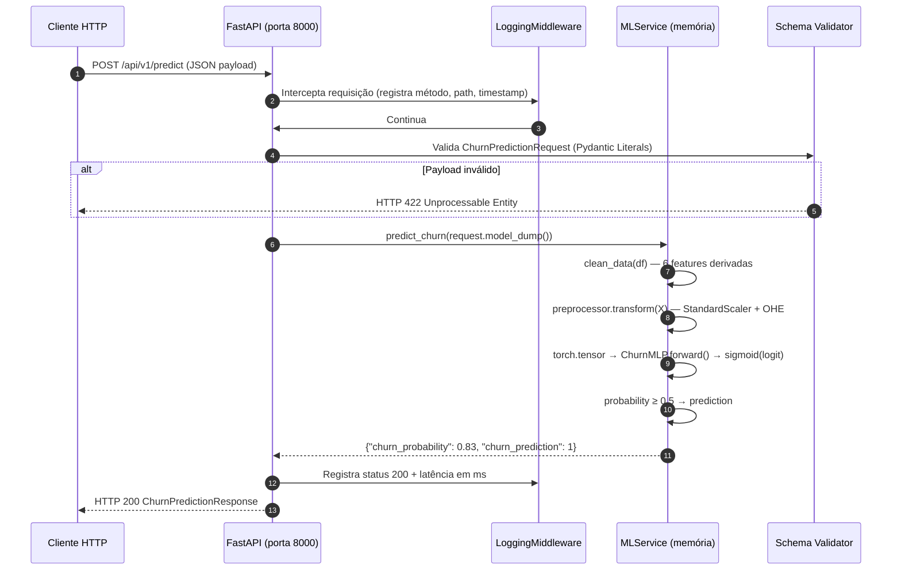

# Arquitetura de Deploy — ML_TELCO_CHURN

> **Versão deste documento:** 1.0.0 — 2026-05-02
> **Baseado em:** evidências diretas do repositório (`Dockerfile`, `docker-compose.yml`, `src/`, `Makefile`).
> **Convenção:** seções marcadas com 🔴 **GAP** indicam ausência atual; seções marcadas com 🟡 **PROPOSTA** indicam sugestão a ser implementada.

---

## 1. Visão Geral

O sistema consiste em dois serviços containerizados que interagem para expor uma API REST de inferência de churn, respaldada pelo MLflow como artefato store e model registry.

```
┌──────────────────────────────────────────────────────────────────────────────────┐
│                            Ambiente de Deploy                                    │
│  (Atualmente: localhost / Docker Compose)                                        │
│                                                                                  │
│  ┌──────────────┐   HTTP REST   ┌──────────────────────────┐                    │
│  │    Client    │──────────────▶│    Serviço: api           │                   │
│  │  (curl/app)  │               │    FastAPI + Uvicorn      │                   │
│  └──────────────┘               │    Porta: 8000            │                   │
│                                 │    /predict  /health      │                   │
│                                 │    /metrics  /feedback    │                   │
│                                 └────────────┬─────────────┘                   │
│                                              │                                  │
│                    ┌─────────────────────────┼─────────────────┐               │
│                    │ scrape /metrics (15s)   │ mlflow.load()   │               │
│                    ▼                         ▼                  │               │
│     ┌──────────────────────┐   ┌──────────────────────────┐    │               │
│     │  Serviço: prometheus  │   │   Serviço: mlflow         │   │               │
│     │  Prometheus Server   │   │   Tracking Server         │   │               │
│     │  Porta: 9090         │   │   Porta: 5000             │   │               │
│     │  infra/prometheus.yml│   │   Backend: SQLite         │   │               │
│     │  infra/alert_rules.yl│   │   (mlflow.db)             │   │               │
│     └──────────┬───────────┘   └───────────────────────────┘   │               │
│                │ datasource                                      │               │
│                ▼                                                 │               │
│     ┌──────────────────────┐                                    │               │
│     │  Serviço: grafana     │                                   │               │
│     │  Grafana Dashboards  │                                    │               │
│     │  Porta: 3000         │                                    │               │
│     └──────────────────────┘                                    │               │
│                                                                  │               │
│                          ┌───────────────────────────────────┐  │               │
│                          │  Volume Compartilhado:            │  │               │
│                          │  ./mlruns/  (artefatos)           │  │               │
│                          │  ./mlflow.db (metadata SQLite)    │  │               │
│                          │  ./monitoring/ (relatórios drift) │  │               │
│                          └───────────────────────────────────┘  │               │
└──────────────────────────────────────────────────────────────────────────────────┘
```

---

## 2. Componentes do Sistema

### 2.1 Serviço `api` — FastAPI

| Propriedade | Valor | Fonte |
|---|---|---|
| Imagem base (runtime) | `python:3.13-slim` | `Dockerfile` |
| Imagem builder | `ghcr.io/astral-sh/uv:python3.13-slim` | `Dockerfile` |
| Porta exposta | `8000` | `docker-compose.yml` |
| Entrypoint | `uvicorn src.main:app --host 0.0.0.0 --port 8000` | `Dockerfile` CMD |
| Variáveis de ambiente | `MODEL_NAME`, `MODEL_STAGE`, `MLFLOW_TRACKING_URI` | `docker-compose.yml` |
| Dependência de inicialização | `service_healthy` do serviço `mlflow` | `docker-compose.yml` |

**Cold start (lifespan):** Ao inicializar, a API executa `MLService.load_model_artifacts()` que:
1. Conecta ao `MLFLOW_TRACKING_URI`
2. Busca o alias `@production` no Model Registry
3. Extrai o `run_id` da versão registrada
4. Carrega o preprocessor Scikit-Learn: `mlflow.sklearn.load_model(f"runs:/{run_id}/preprocessor")`
5. Carrega o modelo PyTorch: `mlflow.pytorch.load_model("models:/MLP_Focal_KFold_Script@production")`
6. Mantém ambos em memória para todas as requisições subsequentes

**Se o carregamento falhar**, o endpoint `/predict` retorna `503 Service Unavailable`. O endpoint `/health` retorna `{"status": "degraded", "model_loaded": false}`.

### 2.2 Serviço `mlflow` — MLflow Tracking Server

| Propriedade | Valor | Fonte |
|---|---|---|
| Imagem | `ghcr.io/astral-sh/uv:python3.13-slim` | `docker-compose.yml` |
| Porta exposta | `5000` | `docker-compose.yml` |
| Backend store | `sqlite:///mlflow.db` | `docker-compose.yml`, `Makefile` |
| Artifact root | `./mlruns` (volume mapeado para o host em `/app/mlruns`) | `docker-compose.yml` |
| Healthcheck | `python3 -c "import socket; s=socket.socket(); s.connect(('localhost',5000))"` | `docker-compose.yml` |

> **Nota operacional:** O comando do container é `uv run mlflow server`. Para funcionar, `mlflow` precisa estar acessível no ambiente `uv`. Se o container não montar `pyproject.toml`/`uv.lock`, pode ser necessário usar `uv tool run mlflow@3.11.1 server ...` ou substituir a imagem por `ghcr.io/mlflow/mlflow:v3.11.1` em ambientes de produção.

**Restrição crítica:** O serviço `mlflow` deve estar íntegro e com os artefatos da run de produção antes do serviço `api` poder responder. Isso é garantido pelo `depends_on: mlflow: condition: service_healthy`.

---

## 3. Diagrama Mermaid — Fluxo de Requisição



---

## 4. Dockerfile — Estratégia Multi-Stage

```
Stage 1: builder
  Base: ghcr.io/astral-sh/uv:python3.13-slim
  Ações:
    - Copia pyproject.toml, uv.lock
    - uv sync --frozen --no-dev  (sem deps de dev/test)
    - Gera .venv com todas as dependências de produção

Stage 2: runtime
  Base: python:3.13-slim
  Ações:
    - Copia .venv do builder (zero dependências de build-time)
    - Copia src/
    - Copia notebooks/data/raw/  (CSVs de dados brutos para treino in-container)
    - Expõe porta 8000
    - CMD: uvicorn src.main:app --host 0.0.0.0 --port 8000
```

**Benefícios:** Imagem final sem `uv`, compiladores ou artefatos de build. Apenas Python, `.venv` e código de aplicação.

---

## 5. Docker Compose — Orquestração Local

```yaml
# Estrutura simplificada — ver docker-compose.yml para valores exatos
services:
  mlflow:
    image: ghcr.io/astral-sh/uv:python3.13-slim
    ports: ["5000:5000"]
    volumes:
      - ./mlruns:/app/mlruns
      - ./mlflow.db:/app/mlflow.db
    working_dir: /app
    command: >
      sh -c "uv run mlflow server
             --backend-store-uri sqlite:///mlflow.db
             --default-artifact-root /app/mlruns
             --host 0.0.0.0
             --port 5000"
    healthcheck:
      test: ["CMD", "python3", "-c",
             "import socket; s=socket.socket(); s.connect(('localhost',5000))"]

  api:
    build: .  # usa o Dockerfile na raiz
    ports: ["8000:8000"]
    depends_on:
      mlflow:
        condition: service_healthy
    environment:
      MODEL_NAME: MLP_Focal_KFold_Script
      MODEL_STAGE: production
      MLFLOW_TRACKING_URI: http://mlflow:5000
      DATABASE_URL: sqlite+aiosqlite:///mlflow.db
    volumes:
      - ./mlruns:/app/mlruns
      - ./mlflow.db:/app/mlflow.db

  prometheus:
    image: prom/prometheus:latest
    ports: ["9090:9090"]
    volumes:
      - ./infra/prometheus.yml:/etc/prometheus/prometheus.yml
      - ./infra/alert_rules.yml:/etc/prometheus/alert_rules.yml
    depends_on: [api]

  grafana:
    image: grafana/grafana:latest
    ports: ["3000:3000"]
    environment:
      GF_SECURITY_ADMIN_PASSWORD: admin
    depends_on: [prometheus]
```

**Comando de deploy:** `docker compose up --build`

**Acesso à stack de observabilidade:**
- API: `http://localhost:8000`
- MLflow UI: `http://localhost:5000`
- Prometheus: `http://localhost:9090`
- Grafana: `http://localhost:3000` (admin / admin)

---

## 6. Makefile — Comandos de Operação

| Target | Comando Expandido | Propósito |
|---|---|---|
| `make test` | `pytest -v tests/` | Executar suíte completa de testes |
| `make train` | `uv run python src/models/train.py [ARGS]` | Treinar e registrar novo modelo |
| `make run` | `uv sync && make db-upgrade && uvicorn src.main:app` | Subir API localmente (sem Docker) |
| `make mlflowui` | `mlflow ui --port 5001 ...` | Abrir UI MLflow na porta 5001 |
| `make db-upgrade` | `mlflow db upgrade sqlite:///mlflow.db` | Aplicar migrations do schema MLflow |
| `make drift` | `python -m src.monitoring.drift_detector --window-days 7` | Gerar relatório de drift de dados |
| `make perf-monitor` | `python -m src.monitoring.performance_monitor --window-days 30` | Avaliar performance com ground truth |
| `make alert-check` | `python -m src.monitoring.alert_check` | Verificar alertas de drift e performance |

---

## 7. Observabilidade e Monitoramento

### 7.1 Endpoints de Observabilidade

| Endpoint | Método | Descrição |
|---|---|---|
| `GET /health` | GET | Status da API, versão e nome do modelo carregado, uptime, URI do MLflow |
| `GET /metrics` | GET | Métricas Prometheus (format texto exposition) |
| `POST /api/v1/feedback/{customer_id}` | POST | Registrar ground truth de churn para uma predição anterior |

**Exemplo de resposta `/health`:**
```json
{
  "status": "ok",
  "model_loaded": true,
  "model_name": "MLP_Focal_KFold_Script",
  "model_version": "3",
  "loaded_at": "2026-05-02T20:00:00+00:00",
  "uptime_seconds": 3600.5,
  "mlflow_uri": "http://mlflow:5000"
}
```

### 7.2 Métricas Prometheus Customizadas

| Métrica | Tipo | Labels | Descrição |
|---|---|---|---|
| `telco_churn_predictions_total` | Counter | `prediction_class` | Total de predições por classe (0/1) |
| `telco_churn_model_loaded` | Gauge | — | 1 se modelo carregado, 0 caso contrário |
| `telco_churn_prediction_probability` | Histogram | — | Distribuição de `churn_probability` |
| `telco_churn_validation_failures_total` | Counter | — | Total de requisições com HTTP 422 |
| `telco_churn_data_drift_psi` | Gauge | `feature` | PSI por feature (gerado via `make drift`) |
| `telco_churn_data_drift_jsd` | Gauge | — | JSD da distribuição de probabilidade |

### 7.3 Regras de Alerta Prometheus (`infra/alert_rules.yml`)

| Alerta | Severidade | Condição | For |
|---|---|---|---|
| `ModelNotLoaded` | critical | `telco_churn_model_loaded == 0` | 2m |
| `HighErrorRate5xx` | critical | Taxa de 5xx > 5% em 5 min | 5m |
| `HighLatencyP95` | warning | p95 latência `/predict` > 2s | 5m |
| `HighValidationFailureRate` | warning | `validation_failures` > 0.1/s | 5m |
| `ApiDown` | critical | API inalcançável | 1m |

### 7.4 Persistência de Predições (SQLite — `PredictionLog`)

A tabela `prediction_logs` é criada automaticamente no startup da API via `init_db()`:

| Coluna | Tipo | Descrição |
|---|---|---|
| `customer_id` | String(50) | ID do cliente |
| `churn_probability` | Float | Probabilidade predita |
| `churn_prediction` | Integer | 0 ou 1 |
| `predicted_at` | DateTime | Timestamp da predição |
| `actual_churn` | Integer (nullable) | Ground truth preenchido via `/feedback` |
| `feedback_at` | DateTime (nullable) | Timestamp do feedback |
| `model_version` | String(100) | Versão do modelo MLflow |
| `request_id` | String(50) | Correlation ID da requisição |

### 7.5 CLIs de Monitoramento (cross-platform)

```bash
# Detecção de drift nos últimos 7 dias
make drift
# ou: python -m src.monitoring.drift_detector --window-days 7

# Avaliação de performance com ground truth (janela 30 dias)
make perf-monitor
# ou: python -m src.monitoring.performance_monitor --window-days 30

# Verificar alertas de drift e performance
make alert-check
# ou: python -m src.monitoring.alert_check --health-url http://localhost:8000/health
```

Relatórios são salvos em `monitoring/reports/drift/`, `monitoring/reports/performance/` e `monitoring/reports/alerts/`.

---

## 8. Fluxo de CI/CD

### 8.1 Estado Atual

🔴 **GAP — CI/CD Ausente.** Não foram encontrados arquivos de pipeline em:
- `.github/workflows/` — GitHub Actions
- `Jenkinsfile` — Jenkins
- `.gitlab-ci.yml` — GitLab CI
- `azure-pipelines.yml` — Azure DevOps
- Qualquer outro arquivo de CI

O processo de treino → validação → deploy é inteiramente **manual**, executado via `Makefile`.

### 8.2 🟡 PROPOSTA — GitHub Actions

O pipeline sugerido abaixo cobre o ciclo completo de ML com qualidade:

```mermaid
flowchart LR
    PR[Pull Request] --> lint[Ruff Lint + Format]
    lint --> test[pytest -v tests/]
    test --> build[docker build --target runtime]
    build --> smoke[/health smoke test]
    smoke --> merge{Aprovado?}
    merge -->|Sim| tag[Git tag vX.Y.Z]
    tag --> registry[Push GHCR]
    registry --> deploy[docker compose up]
    merge -->|Não| block[Block merge]
```

**Arquivo sugerido:** `.github/workflows/ci.yml`

```yaml
# 🟡 PROPOSTA — não implementado
name: CI/CD Pipeline

on:
  push:
    branches: [main]
  pull_request:
    branches: [main]

jobs:
  lint-and-test:
    runs-on: ubuntu-latest
    steps:
      - uses: actions/checkout@v4
      - uses: astral-sh/setup-uv@v3
      - run: uv sync --frozen
      - run: uv run ruff check src/ tests/
      - run: uv run ruff format --check src/ tests/
      - run: uv run pytest tests/ -v

  build-and-smoke:
    needs: lint-and-test
    runs-on: ubuntu-latest
    steps:
      - uses: actions/checkout@v4
      - run: docker compose build api
      - run: docker compose up -d
      - run: sleep 10 && curl -f http://localhost:8000/health
      - run: docker compose down
```

---

## 9. Estratégia de Rollback e Rollout

### 9.1 Estado Atual

🔴 **GAP — Nenhuma estratégia formal de rollout implementada.** O deploy é substituição direta do container. Não há:
- Blue-green deployment
- Canary releases
- Feature flags
- Health-gated deployment

O único mecanismo de fallback disponível é o próprio **MLflow Model Registry**: o alias `@production` pode ser reatribuído para uma versão anterior, e a API recarregada.

### 9.2 Rollback Manual via MLflow Registry

```bash
# Procedimento atual de rollback:
# 1. Identificar run_id da versão anterior no MLflow UI (porta 5000)
# 2. Reatribuir alias via CLI MLflow:
mlflow models set-alias \
  --name MLP_Focal_KFold_Script \
  --alias production \
  --model-version <numero_versao_anterior>

# 3. Reiniciar API para recarregar artefatos:
docker compose restart api
```

### 9.3 🟡 PROPOSTA — Blue-Green Deploy

```
  ┌─── Nginx / Load Balancer ───┐
  │                             │
  ▼                             ▼
[api-blue:8000]          [api-green:8001]
  (versão atual)          (nova versão)
       │
       │  Após validação smoke test:
       ▼
  Redirecionar tráfego para api-green
  Manter api-blue por 24h (rollback rápido)
```

---

## 10. Segurança e Configuração

### 10.1 Gerenciamento de Secrets

| Secret | Método Atual | Recomendação |
|---|---|---|
| `MLFLOW_TRACKING_URI` | Variável de env (docker-compose) | ✅ Aceitável para desenvolvimento |
| `DATABASE_URL` | `os.getenv()` em `config.py` | 🟡 Usar Vault ou AWS Secrets Manager em produção |
| `MODEL_NAME` / `MODEL_STAGE` | Variável de env | ✅ Correto |
| Credenciais MLflow | Nenhuma (sem autenticação) | 🔴 Adicionar autenticação ao MLflow Server em produção |

### 10.2 CORS

Configurado em `src/main.py` com `CORSMiddleware`. Padrão atual é permissivo (`allow_origins=["*"]`).

```python
# Leitura em src/core/config.py (ProjectConfig):
CORS_ORIGINS = [origin.strip() for origin in os.getenv("CORS_ORIGINS", "*").split(",")]
CORS_CREDENTIALS = os.getenv("CORS_CREDENTIALS", "true").lower() == "true"
CORS_METHODS = [m.strip() for m in os.getenv("CORS_METHODS", "*").split(",")]
CORS_HEADERS = [h.strip() for h in os.getenv("CORS_HEADERS", "*").split(",")]

# Uso em src/main.py via settings = CONFIG:
app.add_middleware(
    CORSMiddleware,
    allow_origins=settings.CORS_ORIGINS,
    allow_credentials=settings.CORS_CREDENTIALS,
    allow_methods=settings.CORS_METHODS,
    allow_headers=settings.CORS_HEADERS,
)
```

**Para produção:** `CORS_ORIGINS=https://app.seudominio.com`

### 10.3 Autenticação e Autorização

🔴 **GAP — Sem AuthN/AuthZ implementado.** O endpoint `POST /api/v1/predict` é publicamente acessível sem token. Para produção real:

🟡 **PROPOSTA:** Adicionar `Bearer Token` via `fastapi.security.HTTPBearer` ou integração com OAuth2 (ex: AWS Cognito, Azure AD B2C).

### 10.4 TLS/HTTPS

🔴 **GAP** — Os containers expõem HTTP (porta 8000). Para produção, um proxy reverso (Nginx, Traefik) com certificado TLS é obrigatório.

### 10.5 Rate Limiting

🔴 **GAP** — Sem rate limiting implementado. Risco de abuso por automação.

🟡 **PROPOSTA:** Usar `slowapi` ou `fastapi-limiter` com Redis como backend.

---

## 10. Escalabilidade e Observabilidade

### 10.1 Escalabilidade Horizontal

🔴 **GAP** — O design atual é stateful por container: o modelo é carregado em memória em cada instância. Para escalar horizontalmente com múltiplas réplicas da API, é necessário garantir que todas as réplicas compartilhem o mesmo `MLFLOW_TRACKING_URI` e `mlruns/` acessível (ex: via S3 ou EFS).

🟡 **PROPOSTA — Kubernetes Deployment:**

```yaml
# 🟡 PROPOSTA — não implementado
apiVersion: apps/v1
kind: Deployment
metadata:
  name: telco-churn-api
spec:
  replicas: 3
  selector:
    matchLabels:
      app: telco-churn-api
  template:
    spec:
      containers:
        - name: api
          image: ghcr.io/org/telco-churn-api:latest
          ports:
            - containerPort: 8000
          env:
            - name: MLFLOW_TRACKING_URI
              valueFrom:
                secretKeyRef:
                  name: mlflow-secrets
                  key: tracking-uri
          livenessProbe:
            httpGet:
              path: /health
              port: 8000
          readinessProbe:
            httpGet:
              path: /health
              port: 8000
```

### 10.2 Observabilidade

| Componente | Estado Atual |
|---|---|
| Logging estruturado | ✅ `LoggingMiddleware` loga `method/path/status/latency` em key=value |
| Tracing distribuído | 🔴 Ausente |
| Métricas de sistema (CPU/RAM) | 🔴 Ausente — 🟡 Proposta: Prometheus + Grafana |
| Métricas de ML (drift, degradação) | 🔴 Ausente — ver `docs/MONITORING_PLAN.md` |
| Alertas | 🔴 Ausente |

---

## 11. Inventário de Arquivos de Infraestrutura

| Arquivo | Propósito |
|---|---|
| [Dockerfile](../Dockerfile) | Build multi-stage da imagem da API |
| [docker-compose.yml](../docker-compose.yml) | Orquestração local (`mlflow` + `api`) |
| [Makefile](../Makefile) | Comandos reproduzíveis de dev e operação |
| [pyproject.toml](../pyproject.toml) | Dependências Python + configuração do projeto |
| [src/main.py](../src/main.py) | Entrypoint FastAPI, lifespan, CORS, middlewares |
| [src/core/config.py](../src/core/config.py) | Configuração centralizada via `ProjectConfig` / `CONFIG` |
| [src/core/ml_service.py](../src/core/ml_service.py) | Singleton de carregamento e inferência MLflow |
| [src/core/middlewares.py](../src/core/middlewares.py) | `LoggingMiddleware` — latência e status por request |
| [src/core/database.py](../src/core/database.py) | Engine async SQLAlchemy (aiosqlite) para SQLite |
| [src/api/v1/api.py](../src/api/v1/api.py) | Router FastAPI — `POST /api/v1/predict` |
| [src/core/schemas.py](../src/core/schemas.py) | Contratos Pydantic (`ChurnPredictionRequest/Response`) |
| [mock_request.json](../mock_request.json) | Payload de teste — cliente de alto risco |
| [mock_request_loyal.json](../mock_request_loyal.json) | Payload de teste — cliente fiel |
| [docs/specs/adrs/ADR-003-frameworks-mlops.md](specs/adrs/ADR-003-frameworks-mlops.md) | ADR: Decisão MLflow + FastAPI |
| [docs/specs/adrs/ADR-009-arquitetura-api.md](specs/adrs/ADR-009-arquitetura-api.md) | ADR: Arquitetura Controller-Service FastAPI |

---

## 12. Pré-requisitos para Deploy em Produção

```bash
# 1. Clonar o repositório
git clone <url-do-repositorio>
cd ML_TELCO_CHURN

# 2. Garantir que os artefatos MLflow existem:
#    mlflow.db e mlruns/ devem estar presentes e conter a versão @production
ls mlflow.db mlruns/

# 3. Verificar que a versão @production está registrada:
mlflow models list-versions --name MLP_Focal_KFold_Script

# 4. Build e deploy:
docker compose build
docker compose up -d

# 5. Health check:
curl http://localhost:8000/health
# Esperado: {"status":"ok","model_loaded":true}

# 6. Smoke test de inferência:
curl -X POST http://localhost:8000/api/v1/predict \
  -H "Content-Type: application/json" \
  -d @mock_request.json
# Esperado: {"churn_probability":..., "churn_prediction":...}
```

---

## 13. Decisões Arquiteturais Registradas

| ADR | Decisão |
|---|---|
| [ADR-003](specs/adrs/ADR-003-frameworks-mlops.md) | MLflow para rastreamento + FastAPI para serving |
| [ADR-009](specs/adrs/ADR-009-arquitetura-api.md) | Controller-Service pattern; cold start via lifespan; contrato Pydantic |
