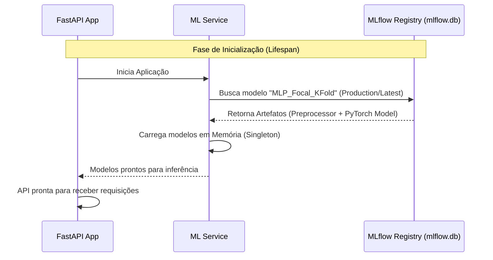
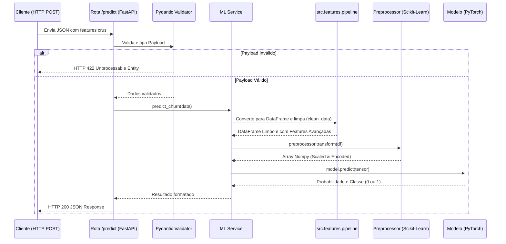

# Spec: Implementação da API de Inferência (FastAPI + MLflow)

## Propósito
Criar a API REST de inferência para o modelo de previsão de Churn (MLP_Focal_KFold), atendendo aos requisitos da Etapa 3 do Tech Challenge (FastAPI, validação Pydantic, logging, reprodutibilidade).

## Arquitetura (Integração Scikit-Learn + PyTorch + FastAPI)
A API utilizará o padrão Lifespan do FastAPI para conectar ao MLflow Model Registry na inicialização, lendo exclusivamente do repositório SQLite (`mlflow.db`). Ela não vai criar, treinar nem manipular arquivos brutos (.joblib/.pt); em vez disso, ela consulta o banco de dados do tracking server via Registry e carrega para a memória a versão de produção do modelo.
O fluxo em real-time (`/predict`) processará os dados exatamente da mesma forma como eles foram tratados em lote, invocando as transformações data-centric contidas em `src/features/pipeline.py`.

### Diagrama de Arquitetura e Inicialização (Cold Start)

### Diagrama de Fluxo de Inferência (Runtime)

## Componentes a serem implementados em `src/api/`

### 1. `schemas.py` (Data Contracts)
- **`ChurnPredictionRequest` (Pydantic BaseModel):** O payload de entrada contendo as variáveis não processadas do cliente. Implementará validações (`@field_validator`) para lidar com casos em branco/nulos em `TotalCharges`.
- **`ChurnPredictionResponse` (Pydantic BaseModel):** Estrutura de retorno com:
  - `churn_probability`: float
  - `churn_prediction`: int (0 ou 1)

### 2. `ml_service.py` (Model Loader & Inference Logic)
- Encapsula a lógica de negócio do MLflow e PyTorch.
- `load_model_artifacts()`: Estabelece URI local do banco sqlite (`sqlite:///mlflow.db`) e interage com o Model Registry para baixar o `preprocessor` e `pytorch_model` da memória, deixando-os como Singleton. O carregamento será via URI do Registry (`models:/<model_name>/<version_or_stage>`).
- `predict_churn(data: dict)`:
  - Converte dict do request em `pd.DataFrame`.
  - Executa `clean_data(df)`.
  - Passa features no `preprocessor.transform()`.
  - Converte array do preprocessor para Tensor e processa no PyTorch Model (`model(tensor)`).
  - Retorna o dicionário de probabilidade e classificação binária.

### 3. `middlewares.py` (Structured Logging)
- `LoggingMiddleware`: Registra o ínicio, a latência de execução de cada requisição no FastAPI usando a biblioteca nativa `logging` em formato de estrutura rastreável (JSON formatado no console, evitando `print()`).

### 4. `main.py` (FastAPI Router)
- **Lifespan/Startup Event:** Chama `load_model_artifacts()` globalmente.
- **`GET /health`**: Verifica os status da aplicação e a disponibilidade do modelo carregado em RAM.
- **`POST /predict`**: Endpoint consumível. Recebe Schema Pydantic validado, chama `ml_service` e devolve a resposta. Em caso de falha (Data Leakage, Model não encontrado), retorna `HTTP 500` formatado.

## Testes Requeridos
Conforme Tech Challenge e CLAUDE.md:
- **Smoke test**: Garantir que a API sobe sem crashar.
- **Testes Unitários / API**: Testar o `/health` e testar que payload com erros levantam HTTP 422 Unprocessable Entity.
- **Pandera Schema test**: Em `tests/`, garantindo que a saída do endpoint obedece a um DataFrame limpo.